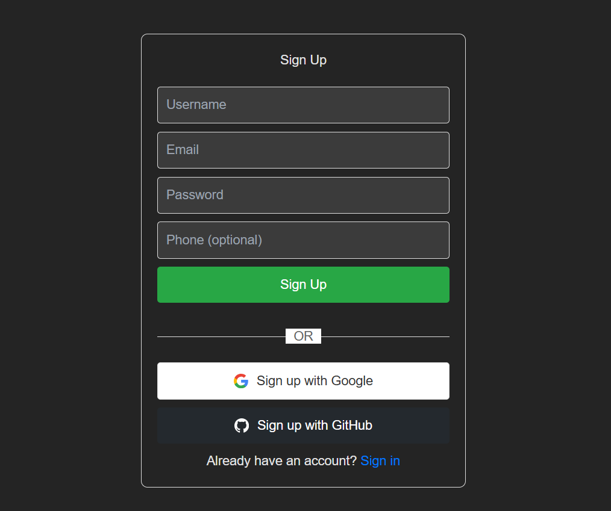
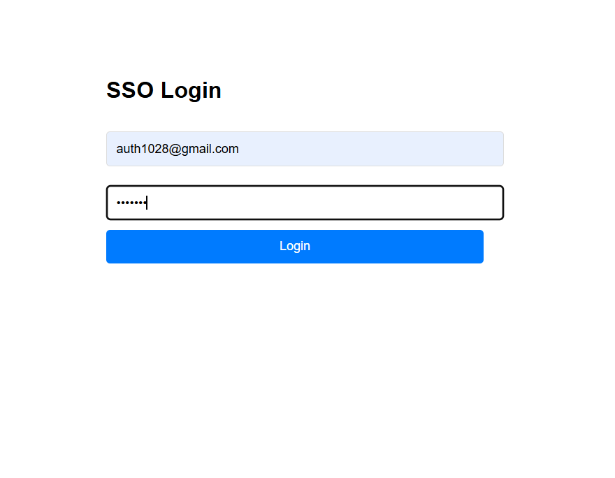
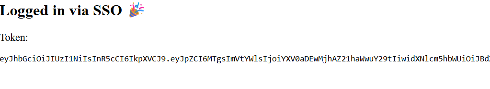
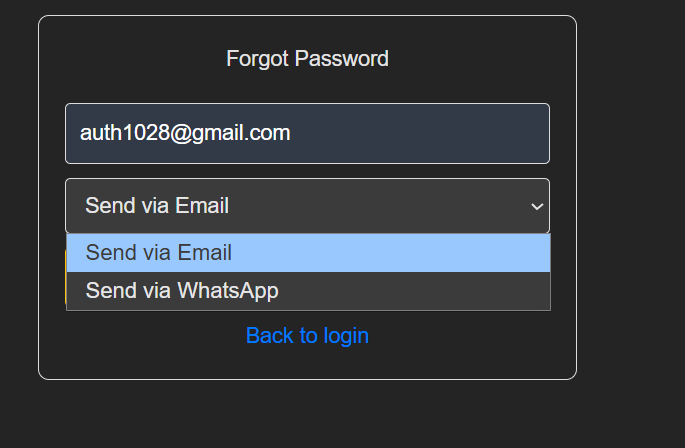
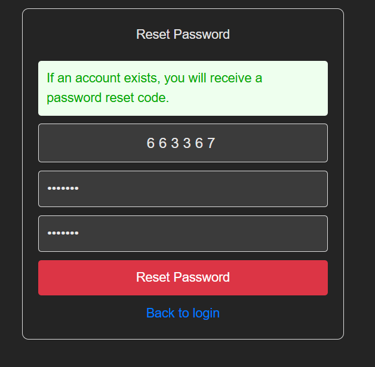
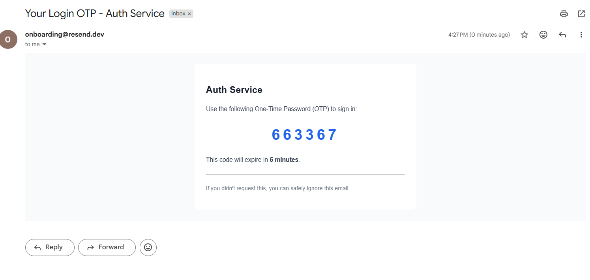
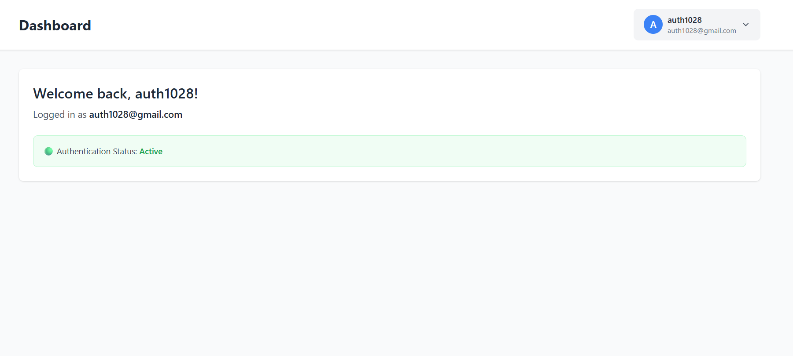

# Auth Service

> A comprehensive authentication microservice with multi-provider support and SSO capabilities

[](https://nodejs.org/) 
[](https://expressjs.com/)
[](https://www.postgresql.org/)
[](https://reactjs.org/)
[](http://www.passportjs.org/)
[](LICENSE)

## Overview

A scalable authentication microservice built with Node.js, Express, PostgreSQL, and React. Provides multiple authentication methods including traditional credentials, OAuth2, OTP verification, and Single Sign-On (SSO) capabilities that can be integrated into any application.

### Why This Service?

- **Centralized authentication** across multiple applications
- **Multiple auth methods** - Email/Password, OAuth2, OTP (Email & WhatsApp), SSO
- **Secure by design** - JWT tokens, bcrypt hashing, secure cookies
- **Easy integration** - Simple redirect flow for any Node + React project
- **Database-backed** - Persistent user management with PostgreSQL

## Features

### Authentication Methods

- ✅ **Email/Password Authentication** - Traditional credential-based login
- ✅ **OTP via Email** - Email verification and password reset
- ✅ **OTP via WhatsApp** - Password reset via Twilio integration
- ✅ **OAuth2 Integration** - Google and GitHub login
- ✅ **Single Sign-On (SSO)** - Unified authentication across multiple apps

### Security Features

- ✅ JWT token-based authentication
- ✅ Secure password hashing with bcrypt
- ✅ HTTP-only cookies for session management
- ✅ Email verification workflow
- ✅ Password reset with OTP validation
- ✅ Protected routes and middleware

### Additional Capabilities

- ✅ User dashboard with profile management
- ✅ Multi-app SSO support with callback URLs
- ✅ Token verification endpoints
- ✅ Example client applications included

> **Note:** This is a complete authentication solution that handles user registration, login, password management, and cross-application SSO. Perfect for microservice architectures or as a standalone auth layer.

## Technology Stack

**Backend:**
- Node.js + Express.js
- PostgreSQL (user database)
- Passport.js (OAuth strategies)
- JWT (token authentication)
- bcrypt (password hashing)
- Resend API (email OTP)
- Twilio (WhatsApp OTP)

**Frontend:**
- React 18 + Vite
- React Router (navigation)
- Axios (API requests)
- Responsive CSS

**Example Clients:**
- 2 sample client applications demonstrating SSO integration

## Project Structure

```
auth-service/
│
├── backend/
│   ├── config/              # Database and OAuth configuration
│   ├── controllers/         # Authentication logic
│   ├── middleware/          # JWT verification, auth guards
│   ├── models/              # User model and database schema
│   ├── routes/              # API endpoints
│   ├── services/            # Email, SMS, token services
│   ├── utils/               # Helper functions
│   ├── index.js             # Entry point
│   └── .env.example         # Environment template
│
├── frontend/
│   ├── src/
│   │   ├── components/      # Reusable UI components
│   │   ├── pages/           # Login, Signup, Dashboard, Reset
│   │   ├── services/        # API integration
│   │   ├── App.jsx          # Main app with routing
│   │   └── main.jsx         # Entry point
│   └── vite.config.js
│
├── client-app-1/            # Example SSO client app 1
├── client-app-2/            # Example SSO client app 2
│
└── screenshots/             # Application screenshots
    ├── SignupPage.png
    ├── loginPage.png
    ├── LoginSSO.png
    ├── ClientappLoginviasso.png
    ├── oauth2.png
    ├── resetPassword.png
    ├── Reset.png
    ├── DummyOTP.png
    └── UserDashboard.png
```

## Quick Start

### Prerequisites

- Node.js 16.x or higher
- PostgreSQL 13+
- npm 7+
- Resend account (for email OTP)
- Twilio account (optional, for WhatsApp OTP)
- Google OAuth credentials (optional)
- GitHub OAuth credentials (optional)

### Installation

**1. Clone the repository**

```bash
git clone https://github.com/NainaKothari-14/auth-service.git
cd auth-service
```

**2. Install Dependencies**

```bash
# Backend dependencies
cd backend
npm install

# Frontend dependencies
cd ../frontend
npm install

# Client app 1 dependencies (optional)
cd ../client-app-1
npm install

# Client app 2 dependencies (optional)
cd ../client-app-2
npm install
```

**3. Database Setup**

Create a PostgreSQL database:

```sql
CREATE DATABASE auth_service;
```

The application will automatically create the required tables on first run.

**4. Environment Configuration**

Create a `.env` file in the `backend/` directory:

```env
# Server Configuration
PORT=5000
NODE_ENV=development
CLIENT_URL=http://localhost:5173

# Database Configuration
DB_HOST=localhost
DB_PORT=5432
DB_NAME=auth_service
DB_USER=your_db_user
DB_PASSWORD=your_db_password

# JWT Configuration
JWT_SECRET=your-super-secret-jwt-key-change-this
JWT_EXPIRES_IN=7d

# Cookie Configuration
COOKIE_SECRET=your-cookie-secret-key-change-this

# Email Service (Resend API)
RESEND_API_KEY=your-resend-api-key
EMAIL_FROM=noreply@yourdomain.com

# Twilio (WhatsApp OTP)
TWILIO_ACCOUNT_SID=your-twilio-account-sid
TWILIO_AUTH_TOKEN=your-twilio-auth-token
TWILIO_WHATSAPP_NUMBER=whatsapp:+14155238886

# Google OAuth
GOOGLE_CLIENT_ID=your-google-client-id
GOOGLE_CLIENT_SECRET=your-google-client-secret
GOOGLE_CALLBACK_URL=http://localhost:5000/auth/google/callback

# GitHub OAuth
GITHUB_CLIENT_ID=your-github-client-id
GITHUB_CLIENT_SECRET=your-github-client-secret
GITHUB_CALLBACK_URL=http://localhost:5000/auth/github/callback

# SSO Configuration
SSO_ALLOWED_ORIGINS=http://localhost:3001,http://localhost:3002
```

**5. Start the Application**

```bash
# Start backend (from backend directory)
cd backend
npm start
# Backend runs at http://localhost:5000

# Start frontend (in new terminal, from frontend directory)
cd frontend
npm run dev
# Frontend runs at http://localhost:5173

# Start client app 1 (optional, in new terminal)
cd client-app-1
npm run dev
# Runs at http://localhost:3001

# Start client app 2 (optional, in new terminal)
cd client-app-2
npm run dev
# Runs at http://localhost:3002
```

**6. Test the Application**

1. Open `http://localhost:5173` for the main auth interface
2. Create a new account using email/password
3. Try OAuth login with Google or GitHub
4. Test password reset with email OTP
5. Open client apps to test SSO integration

**Demo Flow (Optional):**
```
1. Register: test@example.com / Test123!
2. Verify email (check console for OTP in development)
3. Login and access dashboard
4. Test SSO from client-app-1
```

## Screenshots

### User Registration


*Clean signup interface with email verification*

### User Login


*Multiple login options including OAuth providers*

### SSO Authentication


*Single Sign-On interface for cross-application authentication*

### Client App SSO Integration


*Example of client application using SSO for authentication*

### OAuth2 Integration


*Google and GitHub OAuth integration*

### Password Reset Request


*Request password reset via email or WhatsApp OTP*

### Password Reset Confirmation


*Set new password after OTP verification*

### OTP Verification


*Email and WhatsApp OTP verification interface*

### User Dashboard


*Protected user dashboard with profile information*

## API Documentation

### Core Endpoints Overview

| Method | Endpoint | Description | Auth Required |
|--------|----------|-------------|---------------|
| `POST` | `/auth/register` | Create new user account | No |
| `POST` | `/auth/login` | Login with email/password | No |
| `GET` | `/auth/google` | Login with Google OAuth | No |
| `GET` | `/auth/github` | Login with GitHub OAuth | No |
| `POST` | `/auth/forgot-password` | Request password reset OTP | No |
| `POST` | `/auth/reset-password` | Reset password with OTP | No |
| `GET` | `/sso/login` | SSO login page | No |
| `POST` | `/sso/login` | SSO authentication | No |
| `GET` | `/sso/verify` | Verify JWT token | Yes |
| `GET` | `/user/profile` | Get user profile | Yes |

### Detailed API Reference

#### Authentication Endpoints

#### Register User

```http
POST /auth/register
```

**Request Body:**
```json
{
  "email": "user@example.com",
  "password": "SecurePass123!",
  "name": "John Doe"
}
```

**Response:**
```json
{
  "success": true,
  "message": "Registration successful. Please verify your email.",
  "userId": "123"
}
```

---

#### Login User

```http
POST /auth/login
```

**Request Body:**
```json
{
  "email": "user@example.com",
  "password": "SecurePass123!"
}
```

**Response:**
```json
{
  "success": true,
  "token": "eyJhbGciOiJIUzI1NiIsInR5cCI6IkpXVCJ9...",
  "user": {
    "id": "123",
    "email": "user@example.com",
    "name": "John Doe"
  }
}
```

---

#### OAuth Authentication

```http
GET /auth/google
GET /auth/github
```

Redirects to OAuth provider for authentication. On success, redirects back with JWT token.

---

#### Password Reset Request

```http
POST /auth/forgot-password
```

**Request Body:**
```json
{
  "email": "user@example.com",
  "method": "email"  // or "whatsapp"
}
```

**Response:**
```json
{
  "success": true,
  "message": "OTP sent to your email/WhatsApp"
}
```

---

#### Verify OTP & Reset Password

```http
POST /auth/reset-password
```

**Request Body:**
```json
{
  "email": "user@example.com",
  "otp": "123456",
  "newPassword": "NewSecurePass123!"
}
```

---

### SSO Endpoints

#### SSO Login Page

```http
GET /sso/login?callbackUrl=<your-app-url>
```

Displays SSO login page for external applications.

---

#### SSO Authentication

```http
POST /sso/login
```

**Request Body:**
```json
{
  "email": "user@example.com",
  "password": "SecurePass123!",
  "callbackUrl": "http://localhost:3001/auth/callback"
}
```

**Response:**
Redirects to `callbackUrl` with JWT token:
```
http://localhost:3001/auth/callback?token=eyJhbGciOiJIUzI1NiIsInR5cCI6IkpXVCJ9...
```

---

#### Verify JWT Token

```http
GET /sso/verify
```

**Headers:**
```
Authorization: Bearer <jwt-token>
```

**Response:**
```json
{
  "valid": true,
  "user": {
    "id": "123",
    "email": "user@example.com",
    "name": "John Doe"
  }
}
```

---

### Protected Routes

All protected routes require JWT token in Authorization header:

```http
Authorization: Bearer <jwt-token>
```

| Method | Endpoint | Description |
|--------|----------|-------------|
| `GET` | `/user/profile` | Get user profile |
| `PUT` | `/user/profile` | Update user profile |
| `GET` | `/user/dashboard` | Access user dashboard |

## Integration Guide

### Integrating SSO into Your Application

**Step 1: Redirect to SSO Login**

```javascript
// In your client application
const handleSSOLogin = () => {
  const callbackUrl = encodeURIComponent('http://localhost:3001/auth/callback');
  window.location.href = `http://localhost:5000/sso/login?callbackUrl=${callbackUrl}`;
};
```

**Step 2: Handle Callback**

```javascript
// In your callback route (e.g., /auth/callback)
import { useEffect } from 'react';
import { useNavigate, useSearchParams } from 'react-router-dom';

function AuthCallback() {
  const [searchParams] = useSearchParams();
  const navigate = useNavigate();

  useEffect(() => {
    const token = searchParams.get('token');
    
    if (token) {
      // Store token
      localStorage.setItem('authToken', token);
      
      // Verify token
      verifyToken(token).then(user => {
        // Redirect to dashboard
        navigate('/dashboard');
      });
    } else {
      // Handle error
      navigate('/login');
    }
  }, [searchParams, navigate]);

  return <div>Authenticating...</div>;
}
```

**Step 3: Verify Token**

```javascript
async function verifyToken(token) {
  const response = await fetch('http://localhost:5000/sso/verify', {
    headers: {
      'Authorization': `Bearer ${token}`
    }
  });
  
  const data = await response.json();
  return data.user;
}
```

**Step 4: Use Token for Protected Routes**

```javascript
// API service helper
const api = {
  get: async (endpoint) => {
    const token = localStorage.getItem('authToken');
    const response = await fetch(`http://localhost:5000${endpoint}`, {
      headers: {
        'Authorization': `Bearer ${token}`,
        'Content-Type': 'application/json'
      }
    });
    return response.json();
  }
};

// Usage
const userData = await api.get('/user/profile');
```

### Example Client App Integration

See `client-app-1` and `client-app-2` directories for complete working examples of SSO integration.

## Configuration Guide

### Setting Up OAuth Providers

#### Google OAuth Setup

1. Go to [Google Cloud Console](https://console.cloud.google.com/)
2. Create a new project or select existing
3. Navigate to "APIs & Services" → "Credentials"
4. Create OAuth 2.0 Client ID credentials
5. Add authorized redirect URI: `http://localhost:5000/auth/google/callback`
6. Copy Client ID and Client Secret to `.env`

#### GitHub OAuth Setup

1. Go to GitHub Settings → Developer settings → OAuth Apps
2. Click "New OAuth App"
3. Set Authorization callback URL: `http://localhost:5000/auth/github/callback`
4. Copy Client ID and Client Secret to `.env`

### Email Service Setup (Resend)

1. Sign up at [Resend](https://resend.com/)
2. Verify your domain or use their test domain
3. Generate API key
4. Add to `.env` as `RESEND_API_KEY`

### WhatsApp OTP Setup (Twilio)

1. Sign up at [Twilio](https://www.twilio.com/)
2. Get WhatsApp-enabled phone number
3. Copy Account SID and Auth Token to `.env`
4. Test with Twilio's sandbox: `whatsapp:+14155238886`

## Architecture

### How Authentication Works

The service uses JWT tokens for stateless authentication. When users log in, they receive a token that proves their identity for subsequent requests.

**Basic Flow:**
```
User Login → Verify Credentials → Generate JWT → Return Token → User Makes Requests with Token
```

**SSO Flow:**
```
Client App → Redirect to Auth Service → User Logs In → Generate JWT → Redirect Back with Token → Client Verifies Token
```

### Security Implementation

- **Password Storage**: bcrypt hashing with salt rounds
- **Token Management**: JWT with configurable expiration
- **Session Handling**: HTTP-only cookies for web clients
- **CORS Protection**: Configurable allowed origins
- **Input Validation**: Sanitized inputs on all endpoints

## Troubleshooting

### Database Connection Fails

**Symptom:** "ECONNREFUSED" or "database does not exist"

**Solutions:**
- Verify PostgreSQL is running: `sudo service postgresql status`
- Check database credentials in `.env`
- Create database: `createdb auth_service`
- Verify DB_HOST, DB_PORT, DB_USER, DB_PASSWORD

```bash
# Test PostgreSQL connection
psql -h localhost -U your_db_user -d auth_service
```

---

### OAuth Login Fails

**Symptom:** Redirect loop or "invalid_client" error

**Solutions:**
- Verify OAuth credentials in `.env`
- Check callback URLs match exactly in provider settings
- Ensure OAuth providers are enabled in their dashboards
- Clear browser cookies and try again

**Google OAuth:**
```env
GOOGLE_CALLBACK_URL=http://localhost:5000/auth/google/callback
```

**GitHub OAuth:**
```env
GITHUB_CALLBACK_URL=http://localhost:5000/auth/github/callback
```

---

### Email OTP Not Received

**Symptom:** OTP email doesn't arrive

**Solutions:**
- Check spam/junk folder
- Verify Resend API key is valid
- Check email service logs in backend console
- Ensure EMAIL_FROM address is verified in Resend
- Test with Resend dashboard

```javascript
// Check backend logs for errors
console.log('Email service response:', emailResponse);
```

---

### WhatsApp OTP Fails

**Symptom:** WhatsApp message not delivered

**Solutions:**
- Verify Twilio credentials (Account SID, Auth Token)
- Ensure phone number includes country code
- For testing, use Twilio sandbox: join sandbox first
- Check Twilio dashboard for delivery logs
- Verify account has sufficient credits

**Twilio Sandbox Setup:**
1. Send "join <sandbox-code>" to Twilio's WhatsApp number
2. Wait for confirmation
3. Test with your number

---

### JWT Token Invalid

**Symptom:** "Token expired" or "Invalid token"

**Solutions:**
- Check JWT_SECRET matches between token generation and verification
- Verify token hasn't expired (check JWT_EXPIRES_IN)
- Ensure token is sent in correct format: `Bearer <token>`
- Clear localStorage and login again

```javascript
// Correct token format
headers: {
  'Authorization': `Bearer ${token}`
}
```

---

### CORS Errors

**Symptom:** "blocked by CORS policy"

**Solutions:**
- Add client URL to SSO_ALLOWED_ORIGINS in `.env`
- Verify CLIENT_URL is set correctly
- Check CORS middleware configuration

```env
SSO_ALLOWED_ORIGINS=http://localhost:3001,http://localhost:3002,http://localhost:5173
CLIENT_URL=http://localhost:5173
```

---

### Port Already in Use

**Symptom:** "EADDRINUSE" error

**Solutions:**
```bash
# Find and kill process on port 5000
# Windows
netstat -ano | findstr :5000
taskkill /PID <PID> /F

# Mac/Linux
lsof -ti:5000 | xargs kill -9

# Or change port in .env
PORT=5001
```

## Security Best Practices

### Production Checklist

- [ ] Change all default secrets (JWT_SECRET, COOKIE_SECRET)
- [ ] Use strong, unique passwords for database
- [ ] Enable HTTPS (use reverse proxy like nginx)
- [ ] Set secure cookie options (httpOnly, secure, sameSite)
- [ ] Implement rate limiting on auth endpoints
- [ ] Add input validation and sanitization
- [ ] Enable CORS only for trusted origins
- [ ] Store .env files securely (never commit to git)
- [ ] Use environment-specific .env files
- [ ] Enable database connection pooling
- [ ] Set up monitoring and logging
- [ ] Implement account lockout after failed attempts
- [ ] Add email/SMS verification for sensitive operations
- [ ] Use refresh tokens for long-lived sessions

### Environment-Specific Configuration

**Development (.env.development):**
```env
NODE_ENV=development
CLIENT_URL=http://localhost:5173
```

**Production (.env.production):**
```env
NODE_ENV=production
CLIENT_URL=https://yourdomain.com
JWT_EXPIRES_IN=2h
```

## Testing

### Manual Testing Workflow

**1. Test Email/Password Registration:**
- Navigate to signup page
- Enter email, password, name
- Verify email sent
- Check database for new user

**2. Test OAuth Login:**
- Click "Login with Google"
- Authorize with Google account
- Verify redirect and token generation

**3. Test Password Reset:**
- Click "Forgot Password"
- Enter email
- Receive OTP via email
- Enter OTP and new password
- Login with new password

**4. Test SSO Integration:**
- Open client app
- Click "Login with SSO"
- Authenticate in auth service
- Verify redirect back to client
- Confirm user logged in

### Automated Testing (Optional)

```bash
npm install --save-dev jest supertest
```

```javascript
// tests/auth.test.js
const request = require('supertest');
const app = require('../index');

describe('Authentication API', () => {
  it('should register new user', async () => {
    const response = await request(app)
      .post('/auth/register')
      .send({
        email: 'test@example.com',
        password: 'Test123!',
        name: 'Test User'
      });
    
    expect(response.status).toBe(201);
    expect(response.body.success).toBe(true);
  });

  it('should login existing user', async () => {
    const response = await request(app)
      .post('/auth/login')
      .send({
        email: 'test@example.com',
        password: 'Test123!'
      });
    
    expect(response.status).toBe(200);
    expect(response.body).toHaveProperty('token');
  });
});
```

## Docker Deployment (Optional)

> **Note:** Docker deployment is optional. The service works perfectly fine running directly with Node.js and PostgreSQL as shown in Quick Start.

**docker-compose.yml:**

```yaml
version: '3.8'

services:
  postgres:
    image: postgres:13-alpine
    environment:
      POSTGRES_DB: auth_service
      POSTGRES_USER: auth_user
      POSTGRES_PASSWORD: secure_password
    ports:
      - "5432:5432"
    volumes:
      - postgres_data:/var/lib/postgresql/data
  
  backend:
    build: ./backend
    ports:
      - "5000:5000"
    environment:
      - NODE_ENV=production
      - DB_HOST=postgres
      - DB_PORT=5432
      - DB_NAME=auth_service
      - DB_USER=auth_user
      - DB_PASSWORD=secure_password
    depends_on:
      - postgres
    restart: unless-stopped
  
  frontend:
    build: ./frontend
    ports:
      - "80:80"
    depends_on:
      - backend
    restart: unless-stopped

volumes:
  postgres_data:
```

Deploy:

```bash
docker-compose up -d
```

## Future Enhancements

**Advanced Authentication:**
- Two-factor authentication (2FA)
- Biometric authentication support
- Magic link login (passwordless)
- Social login (Facebook, Twitter, LinkedIn)

**Security & Compliance:**
- Account activity logs and audit trails
- IP-based access control
- Session management dashboard
- GDPR compliance features (data export, deletion)

**User Management:**
- Role-based access control (RBAC)
- User groups and permissions
- Admin dashboard for user management
- Bulk user import/export

**Integration & Scalability:**
- Redis for session storage
- Queue system for emails (BullMQ)
- Microservice architecture with message broker
- Multi-tenant support
- API rate limiting per user
- Webhook notifications for auth events

## Contributing

Contributions are welcome! Please follow these steps:

1. Fork the repository
2. Create a feature branch (`git checkout -b feature/2fa-support`)
3. Commit your changes (`git commit -m 'Add 2FA authentication'`)
4. Push to the branch (`git push origin feature/2fa-support`)
5. Open a Pull Request

Please ensure:
- Code follows existing style
- All tests pass
- Documentation is updated
- Security best practices are followed

## License

This project is licensed under the MIT License - see the [LICENSE](LICENSE) file for details.

## Author

**Naina Kothari**  
GitHub: [@NainaKothari-14](https://github.com/NainaKothari-14)

---

⭐ If you find this project helpful, please star the repository!

Built with [Passport.js](http://www.passportjs.org/) | Secured with JWT | Powered by PostgreSQL
